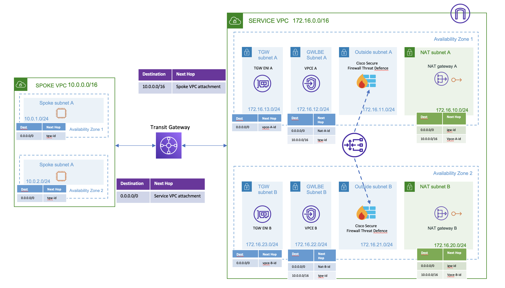

# AWS GWLB Centralized Architecture setup with Cisco Secure Firewall for outbound traffic with existing service and spoke VPC

## Overview

Using this Terraform template following resources will be created:

### Service VPC

- Mgmt, Diag, Outside, Inside subnets per AZ
- One Gateway Load balancer
- 2 Cisco Secure Firewall Threat Defense (FTD) as GWLB Targets
- 1 TGW subnet per AZ
- Default route in TGW subnet route table to Gateway Load balancer Endpoint
- Gateway Load balancer Endpoint(GWLBE) subnets per AZ
- NAT gateway subnets per AZ
- NAT Gateway per AZ
- Default route in GWLBE subnets to NAT Gateway
- Spoke VPC subnet route in GWLBE to Transit Gateway
- Default route in NAT gateway subnets to Internet Gateway

### Transit Gateway

- One Transit Gateway in Service VPC
- Attachments for Transit Gateway to service and spoke vpc
- Transit Gateway Routing table for each attachements

## Appliance mode is enabled for service VPC Transit Gateway Attachment

### Firewall Management Center Configuration

Note: The following FMC configuration is an example configuration making use of the evaluation license. If there are more than 2 FTDv instances deployed then additional "fmc_devices" resources need to be added in the "main.tf" file.

FMC Terraform provider is used to configure the following on the FMC

- FTD Device Registration
- Interface Configuration
- VTEP
- VNI Interface
- NAT rules for health check (conditional)
- Access Policy
- Access Rule to allow health check probe traffic (conditional)
- Inside subnet Gateway Network object

## Topology

## Prerequisites

Make sure you have the following:

- Terraform – Learn how to download and set up [here](https://learn.hashicorp.com/terraform/getting-started/install.html).
- Programmatic access to AWS account with CLI - learn how to set up [here](https://docs.aws.amazon.com/cli/latest/userguide/cli-chap-configure.html)

- Service VPC with a subnet created
- A Cisco Secure Firewall Management Center (FMC) in Service VPC with security groups attached allowing HTTPS traffic and traffic from Cisco Secure Firewall Threat Defense.
- A Keypair should be created on AWS and referenced here
- Spoke VPC and subnets per AZ created

## Steps to Execute

- Create a terraform.tfvars file containing values for all the required variables in the terraform code and place it in the same folder as the rest of the files.
- run ``terraform init`` command
- run ``terraform plan t`` command
- run ``terraform apply t`` command

## Test Setup

To test this setup we will deploy 2 linux machines. One will act as a bastion server to which the user will SSH to. The other machine will be the test machine (without direct internet connection) from which the test traffic to the internet will be generated.

> Note: You can use any pre-existing machine that you have deployed before in your spoke VPC. Following steps are just a suggestion.

### 1. Deploy the Bastion

1. Navigate to the EC2 Dashboard: Click on the "Services" dropdown menu, select "EC2" under the "Compute" section.
2. Click on the "Launch Instance" button.
3. Select an AMI that meets your requirements. In this case, choose an Ubuntu AMI.
4. In instance type, choose "t2.micro".
5. Select the key pair created earlier. This will be used to SSH into your instance.
6. Select Spoke VPC and one Spoke subnet (eg Spoke1) for deployment.
7. Enable "Auto-assign Public IP" so that the instance will have a public IP.
8. Create a new security group or use an existing one. Open the required ports for SSH,HTTP and any other services you want to use.
9. Click on the "Launch" button.

### 2. Deploy the Test machine

1. Navigate to the EC2 Dashboard: Click on the "Services" dropdown menu, select "EC2" under the "Compute" section.
2. Click on the "Launch Instance" button.
3. Select an AMI that meets your requirements. In this case, choose an Ubuntu AMI.
4. In instance type, choose "t2.micro".
5. Select the key pair created earlier. This will be used to SSH into your instance.
6. Select Spoke VPC and one Spoke subnet (eg Spoke2) for deployment. >Note: Use a different subnet for your test machine than what is used for bastion.
7. Disable "Auto-assign Public IP" so that the instance will have a public IP.
8. Create a new security group or use an existing one. Open the required ports for SSH,HTTP and any other services you want to use.
9. Click on the "Launch" button.

## For testing change the route in spoke1 subnet where the bastion host is deployed to point default route to internet gatewat

The template has been tested on :

- Terraform = v1.4.2

## Cleanup

To destroy the resources created on AWS and FMC run the following command in the folder
`terraform destroy`
