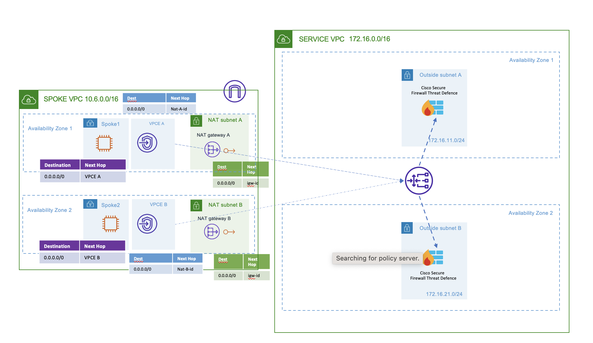

# AWS GWLB Distributed Architecture with Cisco Secure Firewall for Outbound traffic

## Overview

Using this Terraform template following resources will be created:

### Service VPC

- Mgmt, Diag, Outside, Inside subnets per AZ
- One Gateway Load balancer
- 2 Cisco Secure Firewall Threat Defense (FTD) as GWLB Targets

### Spoke VPC

- Spoke VPC
- Gateway Load balancer Endpoint(GWLBE) subnets per AZ
- Gateway Load balancer Endpoint(GWLBE) in GWLBE subnets
- 2 spoke subnets per AZ
- Default route in spoke subnets route tables to GWLBE
- Default route in GWLBE subnets route tables to Internet Gateway
- Route to GWLBE for spoke subnets with Application in Internet Gateway route table

### Terrform for FMC configuration

All the configuration on the Firewall Management Center are done by using the Cisco FMC Terraform Provider.
Note: The following FMC configuration is an example configuration making use of the evaluation license. If there are more than 2 FTDv instances deployed then additional "fmc_devices" resources need to be added in the "main.tf" file.

FMC Terraform provider is used to configure the following on the FMC

- FTD Device Registration
- Interface Configuration
- VTEP
- VNI Interface
- NAT rules for health check (conditional)
- Access Policy
- Access Rule to allow health check probe traffic (conditional)
- Inside subnet Gateway Network object

## Topology

## Prerequisites

Make sure you have the following:

- Terraform – Learn how to download and set up [here](https://learn.hashicorp.com/terraform/getting-started/install.html).
- Programmatic access to AWS account with CLI - learn how to set up [here](https://docs.aws.amazon.com/cli/latest/userguide/cli-chap-configure.html)

- Service VPC with a subnet created
- A Keypair should be created on AWS and referenced here
- A Cisco Secure Firewall Management Center (FMC) in Service VPC with security groups attached allowing HTTPS traffic and traffic from Cisco Secure Firewall Threat Defense.

## Test Setup

To test this setup we will deploy 2 linux machines. One will act as a bastion server to which the user will SSH to. The other machine will be the test machine (without direct internet connection) from which the test traffic to the internet will be generated.

> Note: You can use any pre-existing machine that you have deployed before in your spoke VPC. Following steps are just a suggestion.

### 1. Deploy the Bastion

1. Navigate to the EC2 Dashboard: Click on the "Services" dropdown menu, select "EC2" under the "Compute" section.
2. Click on the "Launch Instance" button.
3. Select an AMI that meets your requirements. In this case, choose an Ubuntu AMI.
4. In instance type, choose "t2.micro".
5. Select the key pair created earlier. This will be used to SSH into your instance.
6. Select Spoke VPC and one Spoke subnet (eg Spoke1) for deployment.
7. Enable "Auto-assign Public IP" so that the instance will have a public IP.
8. Create a new security group or use an existing one. Open the required ports for SSH,HTTP and any other services you want to use.
9. Click on the "Launch" button.

### 2. Deploy the Test machine

1. Navigate to the EC2 Dashboard: Click on the "Services" dropdown menu, select "EC2" under the "Compute" section.
2. Click on the "Launch Instance" button.
3. Select an AMI that meets your requirements. In this case, choose an Ubuntu AMI.
4. In instance type, choose "t2.micro".
5. Select the key pair created earlier. This will be used to SSH into your instance.
6. Select Spoke VPC and one Spoke subnet (eg Spoke2) for deployment. >Note: Use a different subnet for your test machine than what is used for bastion.
7. Disable "Auto-assign Public IP" so that the instance will have a public IP.
8. Create a new security group or use an existing one. Open the required ports for SSH,HTTP and any other services you want to use.
9. Click on the "Launch" button.

The template has been tested on :

- Terraform = v1.4.2

## Cleanup

To destroy the resources created on AWS and FMC run the following command in the folder
`terraform destroy`
