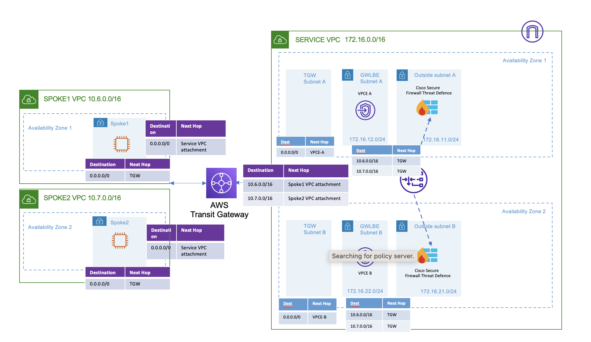

<!-- BEGIN_TF_DOCS -->

# AWS GWLB Centralized Architecture setup with Cisco Secure Firewall in Multiple Spoke Environment

## Overview

Using this Terraform template following resources will be created:

### Service VPC

- Mgmt, Diag, Outside, Inside subnets per AZ
- One Gateway Load balancer
- 2 Cisco Secure Firewall Threat Defense (FTD) as GWLB Targets
- 1 TGW subnet per AZ
- Default route in TGW subnet route table to Gateway Load balancer Endpoint
- Gateway Load balancer Endpoint(GWLBE) subnets per AZ
- Spoke VPC 1 subnet route in GWLBE to Transit Gateway
- Spoke VPC 2 subnet route in GWLBE to Transit Gateway

### Spoke VPC 1

- 1 Spoke VPC with 2 subnets in different AZ

### Spoke VPC 2

- 1 Spoke VPC with 2 subnets in different AZ

### Transit Gateway

- One Transit Gateway
- Attachments for Transit Gateway to service and the 2 spoke vpc
- Transit Gateway Routing table for each attachements

### Terrform for FMC configuration

All the configuration on the Firewall Management Center are done by using the Cisco FMC Terraform Provider.
Note: The following FMC configuration is an example configuration making use of the evaluation license. If there are more than 2 FTDv instances deployed then additional "fmc\_devices" resources need to be added in the "main.tf" file.

FMC Terraform provider is used to configure the following on the FMC

- FTD Device Registration
- Interface Configuration
- VTEP
- VNI Interface
- NAT rules for health check (conditional)
- Access Policy
- Access Rule to allow health check probe traffic (conditional)
- Inside subnet Gateway Network object

Note: After the deployment a default route to the transit gateway need to be added in the spoke subnet route table.

## Topology

```html
<p align="center">
  
</p>
```

## Prerequisites

Make sure you have the following:

- Terraform – Learn how to download and set up [here](https://learn.hashicorp.com/terraform/getting-started/install.html).
- Programmatic access to AWS account with CLI - learn how to set up [here](https://docs.aws.amazon.com/cli/latest/userguide/cli-chap-configure.html)

- Service VPC with a subnet created
- A Keypair should be created on AWS and referenced here
- A Cisco Secure Firewall Management Center (FMC) in Service VPC with security groups attached allowing HTTPS traffic and traffic from Cisco Secure Firewall Threat Defense.

## Requirements

| Name | Version |
|------|---------|
| <a name="requirement\_terraform"></a> [terraform](#requirement\\_terraform) | >= 0.13.5 |
| <a name="requirement\_aws"></a> [aws](#requirement\\_aws) | >= 2.7.0 |

## Providers

| Name | Version |
|------|---------|
| <a name="provider\_aws"></a> [aws](#provider\\_aws) | >= 2.7.0 |
| <a name="provider\_time"></a> [time](#provider\\_time) | n/a |
| <a name="CiscoDevNet/fmc"></a> [CiscoDevNet/fmc](#provider\\_CiscoDevNet/fmc) | 1.4.8 |

## Modules

| Name | Source | Version |
|------|--------|---------|
| <a name="module\_gwlb"></a> [gwlb](#module\\_gwlb) | /Users/sameersingh/git\_repos/terraform-aws-secure-firewall/modules/gwlb | n/a |
| <a name="module\_gwlbe"></a> [gwlbe](#module\\_gwlbe) | /Users/sameersingh/git\_repos/terraform-aws-secure-firewall/modules/gwlbe | n/a |
| <a name="module\_instance"></a> [instance](#module\\_instance) | /Users/sameersingh/git\_repos/terraform-aws-secure-firewall/modules/firewall\_instance | n/a |
| <a name="module\_service\_network"></a> [service\\_network](#module\\_service\\_network) | /Users/sameersingh/git\_repos/terraform-aws-secure-firewall/modules/network | n/a |
| <a name="module\_spoke\_network1"></a> [spoke\\_network1](#module\\_spoke\\_network1) | /Users/sameersingh/git\_repos/terraform-aws-secure-firewall/modules/network | n/a |
| <a name="module\_spoke\_network2"></a> [spoke\\_network2](#module\\_spoke\\_network2) | /Users/sameersingh/git\_repos/terraform-aws-secure-firewall/modules/network | n/a |
| <a name="module\_transitgateway1"></a> [transitgateway1](#module\\_transitgateway1) | /Users/sameersingh/git\_repos/terraform-aws-secure-firewall/modules/transitgateway | n/a |
| <a name="module\_transitgateway2"></a> [transitgateway2](#module\\_transitgateway2) | /Users/sameersingh/git\_repos/terraform-aws-secure-firewall/modules/transitgateway | n/a |

## Resources

| Name | Type |
|------|------|
| time\_sleep.wait\_for\_ftd | resource |
| fmc\_security\_zone.inside | resource |
| fmc\_security\_zone.outside | resource |
| fmc\_security\_zone.vni | resource |
| fmc\_host\_objects.aws\_meta | resource |
| fmc\_host\_objects.inside\_gw | resource |
| fmc\_smart\_license.license | resource |
| fmc\_access\_policies.access\_policy | resource |
| fmc\_access\_rules.access\_rule\_1 | resource |
| fmc\_ftd\_nat\_policies.nat\_policy | resource |
| fmc\_ftd\_manualnat\_rules.new\_rule | resource |
| fmc\_devices.device1 | resource |
| fmc\_devices.device2 | resource |
| fmc\_device\_physical\_interfaces.physical\_interfaces00 | resource |
| fmc\_device\_physical\_interfaces.physical\_interfaces01 | resource |
| fmc\_staticIPv4\_route.route | resource |
| fmc\_policy\_devices\_assignments.policy\_assignment | resource |
| fmc\_device\_vtep.vtep\_policies | resource |
| fmc\_device\_vni.vni | resource |
| fmc\_ftd\_deploy.ftd | resource |
| fmc\_port\_objects.http | data source |
| fmc\_port\_objects.ssh | data source |
| fmc\_network\_objects.any\_ipv4 | data source |
| fmc\_device\_physical\_interfaces.zero\_physical\_interface |  data source |
| fmc\_device\_physical\_interfaces.one\_physical\_interface |  data source |
| fmc\_devices.device | data source |

## Inputs

| Name | Description | Type | Default | Required |
|------|-------------|------|---------|:--------:|
| <a name="input\_availability\_zone\_count"></a> [availability\\_zone\\_count](#input\\_availability\\_zone\\_count) | Spacified availablity zone count . | `number` | `2` | no |
| <a name="input\_aws\_access\_key"></a> [aws\\_access\\_key](#input\\_aws\\_access\\_key) | AWS ACCESS KEY | `string` | n/a | yes |
| <a name="input\_aws\_secret\_key"></a> [aws\\_secret\\_key](#input\\_aws\\_secret\\_key) | AWS SECRET KEY | `string` | n/a | yes |
| <a name="input\_create\_fmc"></a> [create\\_fmc](#input\\_create\\_fmc) | Boolean value to create FMC or not | `bool` | `true` | no |
| <a name="input\_create\_fmc\_spoke1"></a> [create\\_fmc\\_spoke1](#input\\_create\\_fmc\\_spoke1) | Boolean value to create FMC or not | `bool` | `true` | no |
| <a name="input\_create\_fmc\_spoke2"></a> [create\\_fmc\\_spoke2](#input\\_create\\_fmc\\_spoke2) | Boolean value to create FMC or not | `bool` | `true` | no |
| <a name="input\_create\_tgw1"></a> [create\\_tgw1](#input\\_create\\_tgw1) | n/a | `bool` | n/a | yes |
| <a name="input\_create\_tgw2"></a> [create\\_tgw2](#input\\_create\\_tgw2) | n/a | `bool` | n/a | yes |
| <a name="input\_diag\_subnet\_cidr"></a> [diag\\_subnet\\_cidr](#input\\_diag\\_subnet\\_cidr) | List out diagonastic Subnet CIDR . | `list(string)` | `[]` | no |
| <a name="input\_diag\_subnet\_name"></a> [diag\\_subnet\\_name](#input\\_diag\\_subnet\\_name) | Specified diagonstic subnet names | `list(string)` | `[]` | no |
| <a name="input\_domainUUID"></a> [domainUUID](#input\\_domainUUID) | Domain UUID of the cdFMC | `string` | n/a | yes |
| <a name="input\_fmc\_ip"></a> [fmc\\_ip](#input\\_fmc\\_ip) | List out FMCv IPs . | `string` | `""` | no |
| <a name="input\_fmc\_mgmt\_interface\_sg"></a> [fmc\\_mgmt\\_interface\\_sg](#input\\_fmc\\_mgmt\\_interface\\_sg) | Can be specified multiple times for each ingress rule. | <pre>list(object({<br>    from\_port   = number<br>    protocol    = string<br>    to\_port     = number<br>    cidr\_blocks = list(string)<br>    description = string<br>  }))</pre> | <pre>[<br>  {<br>    "cidr\_blocks": [<br>      "0.0.0.0/0"<br>    ],<br>    "description": "FMC Mgmt Interface SG",<br>    "from\_port": 0,<br>    "protocol": "-1",<br>    "to\_port": 0<br>  }<br>]</pre> | no |
| <a name="input\_fmc\_nat\_id"></a> [fmc\\_nat\\_id](#input\\_fmc\\_nat\\_id) | FMC Registration NAT ID | `string` | n/a | yes |
| <a name="input\_fmc\_password"></a> [fmc\\_password](#input\\_fmc\\_password) | n/a | `string` | n/a | yes |
| <a name="input\_fmc\_username"></a> [fmc\\_username](#input\\_fmc\\_username) | n/a | `string` | n/a | yes |
| <a name="input\_ftd\_diag\_ip"></a> [ftd\\_diag\\_ip](#input\\_ftd\\_diag\\_ip) | List out FTD Diagonostic IPs . | `list(string)` | `[]` | no |
| <a name="input\_ftd\_inside\_gw"></a> [ftd\\_inside\\_gw](#input\\_ftd\\_inside\\_gw) | Inside subnet Gateway | `list(string)` | n/a | yes |
| <a name="input\_ftd\_inside\_ip"></a> [ftd\\_inside\\_ip](#input\\_ftd\\_inside\\_ip) | List FTD inside IPs . | `list(string)` | `[]` | no |
| <a name="input\_ftd\_mgmt\_ip"></a> [ftd\\_mgmt\\_ip](#input\\_ftd\\_mgmt\\_ip) | List out management IPs . | `list(string)` | `[]` | no |
| <a name="input\_ftd\_outside\_ip"></a> [ftd\\_outside\\_ip](#input\\_ftd\\_outside\\_ip) | List outside IPs . | `list(string)` | `[]` | no |
| <a name="input\_ftd\_size"></a> [ftd\\_size](#input\\_ftd\\_size) | FTD Instance Size | `string` | `"c5.xlarge"` | no |
| <a name="input\_gwlb\_name"></a> [gwlb\\_name](#input\\_gwlb\\_name) | name for Gateway loadbalancer | `string` | n/a | yes |
| <a name="input\_gwlbe\_subnet\_cidr"></a> [gwlbe\\_subnet\\_cidr](#input\\_gwlbe\\_subnet\\_cidr) | List out GWLBE Subnet CIDR . | `list(string)` | `[]` | no |
| <a name="input\_gwlbe\_subnet\_name"></a> [gwlbe\\_subnet\\_name](#input\\_gwlbe\\_subnet\\_name) | List out GWLBE Subnet names . | `list(string)` | `[]` | no |
| <a name="input\_inside\_interface\_sg"></a> [inside\\_interface\\_sg](#input\\_inside\\_interface\\_sg) | Can be specified multiple times for each ingress rule. | <pre>list(object({<br>    from\_port   = number<br>    protocol    = string<br>    to\_port     = number<br>    cidr\_blocks = list(string)<br>    description = string<br>  }))</pre> | <pre>[<br>  {<br>    "cidr\_blocks": [<br>      "0.0.0.0/0"<br>    ],<br>    "description": "Inside Interface SG",<br>    "from\_port": 0,<br>    "protocol": "-1",<br>    "to\_port": 0<br>  }<br>]</pre> | no |
| <a name="input\_inside\_subnet\_cidr"></a> [inside\\_subnet\\_cidr](#input\\_inside\\_subnet\\_cidr) | List out inside Subnet CIDR . | `list(string)` | `[]` | no |
| <a name="input\_inside\_subnet\_name"></a> [inside\\_subnet\\_name](#input\\_inside\\_subnet\\_name) | Specified inside subnet names | `list(string)` | `[]` | no |
| <a name="input\_instances\_per\_az"></a> [instances\\_per\\_az](#input\\_instances\\_per\\_az) | Spacified no. of instance per az wants to be create . | `number` | `1` | no |
| <a name="input\_is\_cdfmc"></a> [is\\_cdfmc](#input\\_is\\_cdfmc) | Boolean value to decide if target fmc is cdfmc or not | `bool` | `false` | no |
| <a name="input\_keyname"></a> [keyname](#input\\_keyname) | key to be used for the instances | `string` | n/a | yes |
| <a name="input\_mgmt\_interface\_sg"></a> [mgmt\\_interface\\_sg](#input\\_mgmt\\_interface\\_sg) | Can be specified multiple times for each ingress rule. | <pre>list(object({<br>    from\_port   = number<br>    protocol    = string<br>    to\_port     = number<br>    cidr\_blocks = list(string)<br>    description = string<br>  }))</pre> | <pre>[<br>  {<br>    "cidr\_blocks": [<br>      "0.0.0.0/0"<br>    ],<br>    "description": "Mgmt Interface SG",<br>    "from\_port": 0,<br>    "protocol": "-1",<br>    "to\_port": 0<br>  }<br>]</pre> | no |
| <a name="input\_mgmt\_subnet\_cidr"></a> [mgmt\\_subnet\\_cidr](#input\\_mgmt\\_subnet\\_cidr) | List out management Subnet CIDR . | `list(string)` | `[]` | no |
| <a name="input\_mgmt\_subnet\_name"></a> [mgmt\\_subnet\\_name](#input\\_mgmt\\_subnet\\_name) | Specified management subnet names | `list(string)` | `[]` | no |
| <a name="input\_ngw\_subnet\_cidr"></a> [ngw\\_subnet\\_cidr](#input\\_ngw\\_subnet\\_cidr) | List out NGW Subnet CIDR . | `list(string)` | `[]` | no |
| <a name="input\_ngw\_subnet\_name"></a> [ngw\\_subnet\\_name](#input\\_ngw\\_subnet\\_name) | List out NGW Subnet names . | `list(string)` | `[]` | no |
| <a name="input\_outside\_interface\_sg"></a> [outside\\_interface\\_sg](#input\\_outside\\_interface\\_sg) | Can be specified multiple times for each ingress rule. | <pre>list(object({<br>    from\_port   = number<br>    protocol    = string<br>    to\_port     = number<br>    cidr\_blocks = list(string)<br>    description = string<br>  }))</pre> | <pre>[<br>  {<br>    "cidr\_blocks": [<br>      "0.0.0.0/0"<br>    ],<br>    "description": "Outside Interface SG",<br>    "from\_port": 0,<br>    "protocol": "-1",<br>    "to\_port": 0<br>  }<br>]</pre> | no |
| <a name="input\_outside\_subnet\_cidr"></a> [outside\\_subnet\\_cidr](#input\\_outside\\_subnet\\_cidr) | List out outside Subnet CIDR . | `list(string)` | `[]` | no |
| <a name="input\_outside\_subnet\_name"></a> [outside\\_subnet\\_name](#input\\_outside\\_subnet\\_name) | Specified outside subnet names | `list(string)` | `[]` | no |
| <a name="input\_region"></a> [region](#input\\_region) | AWS REGION | `string` | `"us-east-1"` | no |
| <a name="input\_service\_create\_igw"></a> [service\\_create\\_igw](#input\\_service\\_create\\_igw) | Boolean value to decide if to create IGW or not | `bool` | `false` | no |
| <a name="input\_service\_igw\_name"></a> [service\\_igw\\_name](#input\\_service\\_igw\\_name) | name of existing IGW to be used | `string` | `""` | no |
| <a name="input\_service\_vpc\_cidr"></a> [service\\_vpc\\_cidr](#input\\_service\\_vpc\\_cidr) | Service VPC CIDR | `string` | `null` | no |
| <a name="input\_service\_vpc\_name"></a> [service\\_vpc\\_name](#input\\_service\\_vpc\\_name) | Service VPC Name | `string` | `null` | no |
| <a name="input\_spoke1\_create\_igw"></a> [spoke1\\_create\\_igw](#input\\_spoke1\\_create\\_igw) | Condition to create IGW . | `bool` | `true` | no |
| <a name="input\_spoke1\_igw\_name"></a> [spoke1\\_igw\\_name](#input\\_spoke1\\_igw\\_name) | name of existing IGW to be used | `string` | `""` | no |
| <a name="input\_spoke1\_subnet\_cidr"></a> [spoke1\\_subnet\\_cidr](#input\\_spoke1\\_subnet\\_cidr) | List out spoke Subnet CIDR . | `list(string)` | `[]` | no |
| <a name="input\_spoke1\_subnet\_name"></a> [spoke1\\_subnet\\_name](#input\\_spoke1\\_subnet\\_name) | List out spoke Subnet names . | `list(string)` | `[]` | no |
| <a name="input\_spoke1\_vpc\_cidr"></a> [spoke1\\_vpc\\_cidr](#input\\_spoke1\\_vpc\\_cidr) | Specified CIDR for VPC . | `string` | `null` | no |
| <a name="input\_spoke1\_vpc\_name"></a> [spoke1\\_vpc\\_name](#input\\_spoke1\\_vpc\\_name) | Specified VPC Name . | `string` | `null` | no |
| <a name="input\_spoke2\_create\_igw"></a> [spoke2\\_create\\_igw](#input\\_spoke2\\_create\\_igw) | Condition to create IGW . | `bool` | `true` | no |
| <a name="input\_spoke2\_igw\_name"></a> [spoke2\\_igw\\_name](#input\\_spoke2\\_igw\\_name) | name of existing IGW to be used | `string` | `""` | no |
| <a name="input\_spoke2\_subnet\_cidr"></a> [spoke2\\_subnet\\_cidr](#input\\_spoke2\\_subnet\\_cidr) | List out spoke Subnet CIDR . | `list(string)` | `[]` | no |
| <a name="input\_spoke2\_subnet\_name"></a> [spoke2\\_subnet\\_name](#input\\_spoke2\\_subnet\\_name) | List out spoke Subnet names . | `list(string)` | `[]` | no |
| <a name="input\_spoke2\_vpc\_cidr"></a> [spoke2\\_vpc\\_cidr](#input\\_spoke2\\_vpc\\_cidr) | Specified CIDR for VPC . | `string` | `null` | no |
| <a name="input\_spoke2\_vpc\_name"></a> [spoke2\\_vpc\\_name](#input\\_spoke2\\_vpc\\_name) | Specified VPC Name . | `string` | `null` | no |
| <a name="input\_tgw\_subnet\_cidr"></a> [tgw\\_subnet\\_cidr](#input\\_tgw\\_subnet\\_cidr) | List of Transit GW Subnet CIDR | `list(string)` | `[]` | no |
| <a name="input\_tgw\_subnet\_cidr1"></a> [tgw\\_subnet\\_cidr1](#input\\_tgw\\_subnet\\_cidr1) | n/a | `list(string)` | `[]` | no |
| <a name="input\_tgw\_subnet\_cidr2"></a> [tgw\\_subnet\\_cidr2](#input\\_tgw\\_subnet\\_cidr2) | n/a | `list(string)` | `[]` | no |
| <a name="input\_tgw\_subnet\_name1"></a> [tgw\\_subnet\\_name1](#input\\_tgw\\_subnet\\_name1) | List of name for TGW Subnets | `list(string)` | `[]` | no |
| <a name="input\_tgw\_subnet\_name2"></a> [tgw\\_subnet\\_name2](#input\\_tgw\\_subnet\\_name2) | n/a | `list(string)` | `[]` | no |
| <a name="input\_token"></a> [token](#input\\_token) | CDO Access Token | `string` | `""` | no |
| <a name="input\_transit\_gateway\_name1"></a> [transit\\_gateway\\_name1](#input\\_transit\\_gateway\\_name1) | Name of the Transit Gateway created | `string` | `null` | no |
| <a name="input\_transit\_gateway\_name2"></a> [transit\\_gateway\\_name2](#input\\_transit\\_gateway\\_name2) | Name of the Transit Gateway created | `string` | `null` | no |
| <a name="input\_use\_fmc\_eip"></a> [use\\_fmc\\_eip](#input\\_use\\_fmc\\_eip) | boolean value to use EIP on FMC or not | `bool` | `false` | no |
| <a name="input\_use\_ftd\_eip"></a> [use\\_ftd\\_eip](#input\\_use\\_ftd\\_eip) | boolean value to use EIP on FTD or not | `bool` | `false` | no |
| <a name="input\_inscount"></a> [inscount](#input\\_inscount) | number of FTDv instances | `number` | no |

## Outputs

| Name | Description |
|------|-------------|
| <a name="output\_instance\_ip"></a> [instance\\_ip](#output\\_instance\\_ip) | Public IP address of the FTD instances |
| <a name="output\_internet\_gateway"></a> [internet\\_gateway](#output\\_internet\\_gateway) | Internet Gateway ID |
| <a name="output\_fmc\_mgmt\_interface"></a> [fmc\\_mgmt\\_interface](#output\\_fmc\\_mgmt\\_interface) | FMC Mgmt interface details |
| <a name="ftd\_mgmt\_interface\_ips"></a> [ftd\\_mgmt\\_interface\\_ips](#output\\_ftd\\_mgmt\\_interface\\_ips) | FTD mgmt interface details |

## Cleanup

To destroy the resources created on AWS and FMC run the following command
`terraform destroy`

## Requirements

| Name | Version |
|------|---------|
| <a name="requirement_terraform"></a> [terraform](#requirement\_terraform) | >= 0.13.5 |
| <a name="requirement_aws"></a> [aws](#requirement\_aws) | >= 2.7.0 |
| <a name="requirement_fmc"></a> [fmc](#requirement\_fmc) | <= 1.4.8 |
| <a name="requirement_time"></a> [time](#requirement\_time) | 0.10.0 |

## Providers

| Name | Version |
|------|---------|
| <a name="provider_fmc"></a> [fmc](#provider\_fmc) | <= 1.4.8 |
| <a name="provider_time"></a> [time](#provider\_time) | 0.10.0 |

## Modules

| Name | Source | Version |
|------|--------|---------|
| <a name="module_gwlb"></a> [gwlb](#module\_gwlb) | CiscoDevNet/secure-firewall/aws//modules/gwlb | n/a |
| <a name="module_gwlbe"></a> [gwlbe](#module\_gwlbe) | CiscoDevNet/secure-firewall/aws//modules/gwlbe | n/a |
| <a name="module_instance"></a> [instance](#module\_instance) | CiscoDevNet/secure-firewall/aws//modules/firewall_instance | n/a |
| <a name="module_service_network"></a> [service\_network](#module\_service\_network) | CiscoDevNet/secure-firewall/aws//modules/network | n/a |
| <a name="module_spoke_network1"></a> [spoke\_network1](#module\_spoke\_network1) | CiscoDevNet/secure-firewall/aws//modules/network | n/a |
| <a name="module_spoke_network2"></a> [spoke\_network2](#module\_spoke\_network2) | CiscoDevNet/secure-firewall/aws//modules/network | n/a |
| <a name="module_transitgateway1"></a> [transitgateway1](#module\_transitgateway1) | CiscoDevNet/secure-firewall/aws//modules/transitgateway | n/a |
| <a name="module_transitgateway2"></a> [transitgateway2](#module\_transitgateway2) | CiscoDevNet/secure-firewall/aws//modules/transitgateway | n/a |

## Resources

| Name | Type |
|------|------|
| [fmc_access_policies.access_policy](https://registry.terraform.io/providers/CiscoDevNet/fmc/latest/docs/resources/access_policies) | resource |
| [fmc_access_rules.access_rule_1](https://registry.terraform.io/providers/CiscoDevNet/fmc/latest/docs/resources/access_rules) | resource |
| [fmc_device_physical_interfaces.physical_interfaces00](https://registry.terraform.io/providers/CiscoDevNet/fmc/latest/docs/resources/device_physical_interfaces) | resource |
| [fmc_device_physical_interfaces.physical_interfaces01](https://registry.terraform.io/providers/CiscoDevNet/fmc/latest/docs/resources/device_physical_interfaces) | resource |
| [fmc_device_vni.vni](https://registry.terraform.io/providers/CiscoDevNet/fmc/latest/docs/resources/device_vni) | resource |
| [fmc_device_vtep.vtep_policies](https://registry.terraform.io/providers/CiscoDevNet/fmc/latest/docs/resources/device_vtep) | resource |
| [fmc_devices.device1](https://registry.terraform.io/providers/CiscoDevNet/fmc/latest/docs/resources/devices) | resource |
| [fmc_devices.device2](https://registry.terraform.io/providers/CiscoDevNet/fmc/latest/docs/resources/devices) | resource |
| [fmc_ftd_deploy.ftd](https://registry.terraform.io/providers/CiscoDevNet/fmc/latest/docs/resources/ftd_deploy) | resource |
| [fmc_ftd_manualnat_rules.new_rule](https://registry.terraform.io/providers/CiscoDevNet/fmc/latest/docs/resources/ftd_manualnat_rules) | resource |
| [fmc_ftd_nat_policies.nat_policy](https://registry.terraform.io/providers/CiscoDevNet/fmc/latest/docs/resources/ftd_nat_policies) | resource |
| [fmc_host_objects.aws_meta](https://registry.terraform.io/providers/CiscoDevNet/fmc/latest/docs/resources/host_objects) | resource |
| [fmc_host_objects.inside_gw](https://registry.terraform.io/providers/CiscoDevNet/fmc/latest/docs/resources/host_objects) | resource |
| [fmc_policy_devices_assignments.policy_assignment](https://registry.terraform.io/providers/CiscoDevNet/fmc/latest/docs/resources/policy_devices_assignments) | resource |
| [fmc_security_zone.inside](https://registry.terraform.io/providers/CiscoDevNet/fmc/latest/docs/resources/security_zone) | resource |
| [fmc_security_zone.outside](https://registry.terraform.io/providers/CiscoDevNet/fmc/latest/docs/resources/security_zone) | resource |
| [fmc_security_zone.vni](https://registry.terraform.io/providers/CiscoDevNet/fmc/latest/docs/resources/security_zone) | resource |
| [fmc_smart_license.license](https://registry.terraform.io/providers/CiscoDevNet/fmc/latest/docs/resources/smart_license) | resource |
| [fmc_staticIPv4_route.route](https://registry.terraform.io/providers/CiscoDevNet/fmc/latest/docs/resources/staticIPv4_route) | resource |
| [time_sleep.wait_for_ftd](https://registry.terraform.io/providers/hashicorp/time/0.10.0/docs/resources/sleep) | resource |
| [fmc_device_physical_interfaces.one_physical_interface](https://registry.terraform.io/providers/CiscoDevNet/fmc/latest/docs/data-sources/device_physical_interfaces) | data source |
| [fmc_device_physical_interfaces.zero_physical_interface](https://registry.terraform.io/providers/CiscoDevNet/fmc/latest/docs/data-sources/device_physical_interfaces) | data source |
| [fmc_devices.device](https://registry.terraform.io/providers/CiscoDevNet/fmc/latest/docs/data-sources/devices) | data source |
| [fmc_network_objects.any_ipv4](https://registry.terraform.io/providers/CiscoDevNet/fmc/latest/docs/data-sources/network_objects) | data source |
| [fmc_port_objects.http](https://registry.terraform.io/providers/CiscoDevNet/fmc/latest/docs/data-sources/port_objects) | data source |
| [fmc_port_objects.ssh](https://registry.terraform.io/providers/CiscoDevNet/fmc/latest/docs/data-sources/port_objects) | data source |

## Inputs

| Name | Description | Type | Default | Required |
|------|-------------|------|---------|:--------:|
| <a name="input_aws_access_key"></a> [aws\_access\_key](#input\_aws\_access\_key) | AWS ACCESS KEY | `string` | n/a | yes |
| <a name="input_aws_secret_key"></a> [aws\_secret\_key](#input\_aws\_secret\_key) | AWS SECRET KEY | `string` | n/a | yes |
| <a name="input_fmc_nat_id"></a> [fmc\_nat\_id](#input\_fmc\_nat\_id) | FMC Registration NAT ID | `string` | n/a | yes |
| <a name="input_fmc_password"></a> [fmc\_password](#input\_fmc\_password) | FMC admin password | `string` | n/a | yes |
| <a name="input_ftd_admin_password"></a> [ftd\_admin\_password](#input\_ftd\_admin\_password) | FTD Admin password | `string` | n/a | yes |
| <a name="input_keyname"></a> [keyname](#input\_keyname) | key to be used for the instances | `string` | n/a | yes |
| <a name="input_reg_key"></a> [reg\_key](#input\_reg\_key) | FTD registration key | `string` | n/a | yes |
| <a name="input_availability_zone_count"></a> [availability\_zone\_count](#input\_availability\_zone\_count) | Spacified availablity zone count . | `number` | `2` | no |
| <a name="input_block_encrypt"></a> [block\_encrypt](#input\_block\_encrypt) | boolean value to encrypt block or not | `bool` | `true` | no |
| <a name="input_create_tgw1"></a> [create\_tgw1](#input\_create\_tgw1) | condition to create transit gateway1 | `bool` | `true` | no |
| <a name="input_create_tgw2"></a> [create\_tgw2](#input\_create\_tgw2) | condition to create transit gateway2 | `bool` | `false` | no |
| <a name="input_diag_subnet_cidr"></a> [diag\_subnet\_cidr](#input\_diag\_subnet\_cidr) | List out diagonastic Subnet CIDR . | `list(string)` | <pre>[<br>  "172.16.24.0/24",<br>  "172.16.240.0/24"<br>]</pre> | no |
| <a name="input_diag_subnet_name"></a> [diag\_subnet\_name](#input\_diag\_subnet\_name) | Specified diagonstic subnet names | `list(string)` | <pre>[<br>  "diag1",<br>  "diag2"<br>]</pre> | no |
| <a name="input_fmc_host"></a> [fmc\_host](#input\_fmc\_host) | FMC public IP | `string` | `""` | no |
| <a name="input_fmc_insecure_skip_verify"></a> [fmc\_insecure\_skip\_verify](#input\_fmc\_insecure\_skip\_verify) | Condition to verify FMC certificate | `bool` | `true` | no |
| <a name="input_fmc_ip"></a> [fmc\_ip](#input\_fmc\_ip) | List out FMCv IPs . | `string` | `""` | no |
| <a name="input_fmc_username"></a> [fmc\_username](#input\_fmc\_username) | FMC username | `string` | `"admin"` | no |
| <a name="input_ftd_inside_gw"></a> [ftd\_inside\_gw](#input\_ftd\_inside\_gw) | Inside subnet Gateway | `list(string)` | <pre>[<br>  "172.16.29.1",<br>  "172.16.190.1"<br>]</pre> | no |
| <a name="input_ftd_size"></a> [ftd\_size](#input\_ftd\_size) | FTD Instance Size | `string` | `"c5.xlarge"` | no |
| <a name="input_ftd_version"></a> [ftd\_version](#input\_ftd\_version) | FTD version | `string` | `"ftdv-7.2.7"` | no |
| <a name="input_gwlb_name"></a> [gwlb\_name](#input\_gwlb\_name) | name for Gateway loadbalancer | `string` | `"GWLB"` | no |
| <a name="input_gwlb_tg_name"></a> [gwlb\_tg\_name](#input\_gwlb\_tg\_name) | GWLB Target group name | `string` | `"gwlb-tg"` | no |
| <a name="input_gwlbe_subnet_cidr"></a> [gwlbe\_subnet\_cidr](#input\_gwlbe\_subnet\_cidr) | List out GWLBE Subnet CIDR . | `list(string)` | <pre>[<br>  "172.18.212.0/24",<br>  "172.18.232.0/24"<br>]</pre> | no |
| <a name="input_gwlbe_subnet_name"></a> [gwlbe\_subnet\_name](#input\_gwlbe\_subnet\_name) | List out GWLBE Subnet names . | `list(string)` | <pre>[<br>  "gwlb1",<br>  "gwlb2"<br>]</pre> | no |
| <a name="input_inscount"></a> [inscount](#input\_inscount) | FTD instance count | `number` | `2` | no |
| <a name="input_inside_interface_sg"></a> [inside\_interface\_sg](#input\_inside\_interface\_sg) | Can be specified multiple times for each ingress rule. | <pre>list(object({<br>    from_port   = number<br>    protocol    = string<br>    to_port     = number<br>    cidr_blocks = list(string)<br>    description = string<br>  }))</pre> | <pre>[<br>  {<br>    "cidr_blocks": [<br>      "172.16.29.0/24",<br>      "172.16.190.0/24"<br>    ],<br>    "description": "HTTP Access",<br>    "from_port": 80,<br>    "protocol": "TCP",<br>    "to_port": 80<br>  }<br>]</pre> | no |
| <a name="input_inside_subnet_cidr"></a> [inside\_subnet\_cidr](#input\_inside\_subnet\_cidr) | List out inside Subnet CIDR . | `list(string)` | <pre>[<br>  "172.16.29.0/24",<br>  "172.16.190.0/24"<br>]</pre> | no |
| <a name="input_inside_subnet_name"></a> [inside\_subnet\_name](#input\_inside\_subnet\_name) | Specified inside subnet names | `list(string)` | <pre>[<br>  "inside1",<br>  "inside2"<br>]</pre> | no |
| <a name="input_instances_per_az"></a> [instances\_per\_az](#input\_instances\_per\_az) | Spacified no. of instance per az wants to be create . | `number` | `1` | no |
| <a name="input_mgmt_interface_sg"></a> [mgmt\_interface\_sg](#input\_mgmt\_interface\_sg) | Can be specified multiple times for each ingress rule. | <pre>list(object({<br>    from_port   = number<br>    protocol    = string<br>    to_port     = number<br>    cidr_blocks = list(string)<br>    description = string<br>  }))</pre> | <pre>[<br>  {<br>    "cidr_blocks": [<br>      "172.16.0.0/24"<br>    ],<br>    "description": "Mgmt Traffic from FMC",<br>    "from_port": 8305,<br>    "protocol": "TCP",<br>    "to_port": 8305<br>  }<br>]</pre> | no |
| <a name="input_mgmt_subnet_cidr"></a> [mgmt\_subnet\_cidr](#input\_mgmt\_subnet\_cidr) | List out management Subnet CIDR . | `list(string)` | <pre>[<br>  "172.16.220.0/24",<br>  "172.16.210.0/24"<br>]</pre> | no |
| <a name="input_mgmt_subnet_name"></a> [mgmt\_subnet\_name](#input\_mgmt\_subnet\_name) | Specified management subnet names | `list(string)` | <pre>[<br>  "mgmt1",<br>  "mgmt2"<br>]</pre> | no |
| <a name="input_outside_interface_sg"></a> [outside\_interface\_sg](#input\_outside\_interface\_sg) | Can be specified multiple times for each ingress rule. | <pre>list(object({<br>    from_port   = number<br>    protocol    = string<br>    to_port     = number<br>    cidr_blocks = list(string)<br>    description = string<br>  }))</pre> | <pre>[<br>  {<br>    "cidr_blocks": [<br>      "172.16.230.0/24",<br>      "172.16.241.0/24"<br>    ],<br>    "description": "GENEVE Access",<br>    "from_port": 6081,<br>    "protocol": "UDP",<br>    "to_port": 6081<br>  },<br>  {<br>    "cidr_blocks": [<br>      "172.16.230.0/24",<br>      "172.16.241.0/24"<br>    ],<br>    "description": "SSH Access",<br>    "from_port": 22,<br>    "protocol": "TCP",<br>    "to_port": 22<br>  }<br>]</pre> | no |
| <a name="input_outside_subnet_cidr"></a> [outside\_subnet\_cidr](#input\_outside\_subnet\_cidr) | List out outside Subnet CIDR . | `list(string)` | <pre>[<br>  "172.16.230.0/24",<br>  "172.16.241.0/24"<br>]</pre> | no |
| <a name="input_outside_subnet_name"></a> [outside\_subnet\_name](#input\_outside\_subnet\_name) | Specified outside subnet names | `list(string)` | <pre>[<br>  "outside1",<br>  "outside2"<br>]</pre> | no |
| <a name="input_region"></a> [region](#input\_region) | AWS REGION | `string` | `"us-east-1"` | no |
| <a name="input_service_create_igw"></a> [service\_create\_igw](#input\_service\_create\_igw) | Boolean value to decide if to create IGW or not | `bool` | `false` | no |
| <a name="input_service_igw_name"></a> [service\_igw\_name](#input\_service\_igw\_name) | name of existing IGW to be used | `string` | `"service-igw"` | no |
| <a name="input_service_vpc_name"></a> [service\_vpc\_name](#input\_service\_vpc\_name) | Service VPC Name | `string` | `"service-vpc"` | no |
| <a name="input_spoke1_create_igw"></a> [spoke1\_create\_igw](#input\_spoke1\_create\_igw) | Condition to create IGW . | `bool` | `true` | no |
| <a name="input_spoke1_igw_name"></a> [spoke1\_igw\_name](#input\_spoke1\_igw\_name) | name of existing IGW to be used | `string` | `"spoke-igw"` | no |
| <a name="input_spoke1_subnet_cidr"></a> [spoke1\_subnet\_cidr](#input\_spoke1\_subnet\_cidr) | List out spoke Subnet CIDR . | `list(string)` | <pre>[<br>  "172.16.1.0/24",<br>  "172.16.2.0/24"<br>]</pre> | no |
| <a name="input_spoke1_subnet_name"></a> [spoke1\_subnet\_name](#input\_spoke1\_subnet\_name) | List out spoke Subnet names . | `list(string)` | <pre>[<br>  "web3",<br>  "web4"<br>]</pre> | no |
| <a name="input_spoke1_vpc_cidr"></a> [spoke1\_vpc\_cidr](#input\_spoke1\_vpc\_cidr) | Specified CIDR for VPC . | `string` | `"172.16.0.0/16"` | no |
| <a name="input_spoke1_vpc_name"></a> [spoke1\_vpc\_name](#input\_spoke1\_vpc\_name) | Specified VPC Name . | `string` | `"spoke-vpc"` | no |
| <a name="input_spoke2_create_igw"></a> [spoke2\_create\_igw](#input\_spoke2\_create\_igw) | Condition to create IGW . | `bool` | `true` | no |
| <a name="input_spoke2_igw_name"></a> [spoke2\_igw\_name](#input\_spoke2\_igw\_name) | name of existing IGW to be used | `string` | `"spoke2-igw"` | no |
| <a name="input_spoke2_subnet_cidr"></a> [spoke2\_subnet\_cidr](#input\_spoke2\_subnet\_cidr) | List out spoke Subnet CIDR . | `list(string)` | <pre>[<br>  "172.17.1.0/24",<br>  "172.17.2.0/24"<br>]</pre> | no |
| <a name="input_spoke2_subnet_name"></a> [spoke2\_subnet\_name](#input\_spoke2\_subnet\_name) | List out spoke Subnet names . | `list(string)` | <pre>[<br>  "db1",<br>  "db2"<br>]</pre> | no |
| <a name="input_spoke2_vpc_cidr"></a> [spoke2\_vpc\_cidr](#input\_spoke2\_vpc\_cidr) | Specified CIDR for VPC . | `string` | `"172.17.0.0/16"` | no |
| <a name="input_spoke2_vpc_name"></a> [spoke2\_vpc\_name](#input\_spoke2\_vpc\_name) | Specified VPC Name . | `string` | `"spoke2-vpc"` | no |
| <a name="input_tgw_subnet_cidr"></a> [tgw\_subnet\_cidr](#input\_tgw\_subnet\_cidr) | List of Transit GW Subnet CIDR | `list(string)` | `[]` | no |
| <a name="input_tgw_subnet_cidr1"></a> [tgw\_subnet\_cidr1](#input\_tgw\_subnet\_cidr1) | transit gateway subnet cidr | `list(string)` | <pre>[<br>  "172.18.215.0/24",<br>  "172.18.225.0/24"<br>]</pre> | no |
| <a name="input_tgw_subnet_name1"></a> [tgw\_subnet\_name1](#input\_tgw\_subnet\_name1) | List of name for TGW Subnets | `list(string)` | <pre>[<br>  "tgw1",<br>  "tgw2"<br>]</pre> | no |
| <a name="input_transit_gateway_name1"></a> [transit\_gateway\_name1](#input\_transit\_gateway\_name1) | Name of the Transit Gateway created | `string` | `"tg-1"` | no |
| <a name="input_use_fmc_eip"></a> [use\_fmc\_eip](#input\_use\_fmc\_eip) | boolean value to use EIP on FMC or not | `bool` | `false` | no |
| <a name="input_use_ftd_eip"></a> [use\_ftd\_eip](#input\_use\_ftd\_eip) | boolean value to use EIP on FTD or not | `bool` | `false` | no |

## Outputs

| Name | Description |
|------|-------------|
| <a name="output_fmc_mgmt_interface"></a> [fmc\_mgmt\_interface](#output\_fmc\_mgmt\_interface) | FMC mgmt interface details |
| <a name="output_ftd_mgmt_interface_ips"></a> [ftd\_mgmt\_interface\_ips](#output\_ftd\_mgmt\_interface\_ips) | FTD mgmt interface details |
| <a name="output_instance_ip"></a> [instance\_ip](#output\_instance\_ip) | Public IP address of the FTD instances |
| <a name="output_internet_gateway"></a> [internet\_gateway](#output\_internet\_gateway) | Internet Gateway ID |
<!-- END_TF_DOCS -->